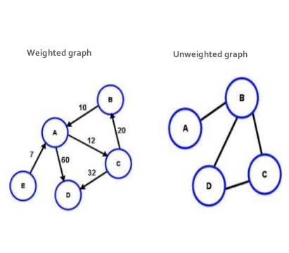

> 본 문서는 Hello Coding 그림으로 개념을 이해하는 알고리즘 책을 공부하고 정리한 내용입니다.

가중치가 있는 `가중 그래프` 에서 최단거리를 찾을때 사용되는 알고리즘이다. 가중치가 없는 `균일 그래프` 에서는 너비 우선 탐색 알고리즘을 사용한다.


[출처: https://es.slideshare.net](https://es.slideshare.net/DyutiIslam/welcome-to-my-prsentation-on-graph-and-tree-55595366)

너비 우선 탐색에서의 최단거리 검색은 최소 경로를 찾지만 다익스트라 알고리즘은 가중치가 있는 그래프일 경우 가장 싼 코스트를 가질 수 있는 경로를 탐색한다.

## 구현

```
        /(6)  A   (1)\
start      (3)|        Fin
        \(2)  B   (5)/
```

- 가격표에서 처리하지 않은 노드 중 가장 싼 값을 가진 노드를 찾는다.
- 해당 노드의 이웃 가격을 구한다.
- 출발점 > 해당노드 > 이웃노드 로 가는 경로의 합을 구하고 옛 가격표의 가격과 비교하여 구한값이 작다면 갱신해준다.
- 갱신되었다면 해당하는 경로를 지나는 정점을 부모 노드로 갱신한다.

```python
# 그래프
graph = {
    'start': {'A':6,'B':2},
    'A':{'fin':1,},
    'B':{'A':3,'fin':5},
    'fin':{},
    'costs':{'A':6, 'B':2,'fin':float('inf')},
    'parents':{'A':'start','B':'start','fin':None},
}

def dijkstra(graph):
    processed = []

    def find_lowest_cost_node(costs):
        lowest_cost = float('inf')
        lowest_cost_node = None

        # 모든 정점을 확인
        for node in costs:
            cost = costs[node]

            # 아직 처리하지 않은 정점중 싼 것이 있으면
            if cost < lowest_cost and node not in processed:

                # 새로운 최저 정점으로 설정한다.
                lowest_cost = cost
                lowest_cost_node = node

        return lowest_cost_node

    # 아직 처리하지 않은 가장 싼 정점을 찾는다.
    node = find_lowest_cost_node(graph['costs'])

    # 모든 정점을 처리하면 반복문이 종료된다.
    while node is not None:
        cost = graph['costs'][node]
        neighbors = graph[node]

        # 모든 이웃에 대해 반복한다.
        for n in neighbors.keys():
            new_cost = cost + neighbors[n]

            # 만약 이 정점을 지나는 것이 가격이 더 싸다면
            if graph['costs'][n] > new_cost:

                # 가격을 갱신하고
                graph['costs'][n] = new_cost
                # 부모를 이 정점으로 갱신한다.
                graph['parents'][n] = node

        # 정점을 처리한 사실을 기록한다.
        processed.append(node)

        # 다음으로 처리할 정점을 찾아 반복한다.
        node = find_lowest_cost_node(graph['costs'])
    print(graph)
```

```python
dijkstra(graph)
>> {
    'start': {'A': 6, 'B': 2},
    'A': {'fin': 1},
    'B': {'A': 3, 'fin': 5},
    'fin': {},
    'costs': {'A': 5, 'B': 2, 'fin': 6},
    'parents': {'A': 'B', 'B': 'start', 'fin': 'A'}
    }
```

## 요약

- 너비 우선 탐색은 가중치가 없는 균일 그래프에서 최단 경로를 계산하는데 사용된다.
- 다익스트라 알고리즘은 가중 그래프에서 최단 거리를 계산하는 데 사용된다.
- 다익스트라 알고리즘은 모든 가중치가 양수일때만 정상적으로 동작한다.
- 만약 가중치가 음수이면 벨먼-포드 알고리즘을 사용한다.
