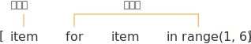
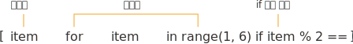

## 반복문 (for, while)

시퀀스형 데이터를 순회할 때 사용된다.

### String 순회

```python
for char in 'ASDFASDF':
	print(char)

A
S
D
F
A
S
D
F
```

### 리스트 순회

```python
l = [1, 2, 3, 4, 5, 6, 'list01', 'list02']

for i in l:
	print(i)

1
2
3
4
5
6
list01
list02
```

i 는 순차적으로 리스트 내부에 있는 값을 할당받게 된다.

리스트 내부에 또다른 리스트가 있을 경우 그 값을 순차적으로 출력하려면 for 문을 중첩하여 사용하면 된다.

```python
l = [
    [1,2,3],
    [4,5,6],
    [7,8,9],
]

for i in l:
    for e in i:
    	print(e)

1
2
3
4
5
6
7
8
9

```

### 딕셔너리 순회

```python
fruits = {
	'apple':'사과',
	'banana':'바나나',
	'cherry':'체리',
}

for item in fruits:
	print(item)

apple
banana
cherry
```

딕셔너리를 그냥 출력하게 되면 key 값만 나온다. 위의 결과는 아래의 결과와 같다.

```python
for item in fruits.keys():
	print(item)

apple
banana
cherry
```

values 들을 출력하고 싶을 때는 위의 `keys()` 부분을 `values()` 로 바꾸어 주면 된다.

for 문으로 key 값과 value 값을 전부 string 값을 출력하려면 아래와 같이 해보자

```python
for item in fruits.items():
    print(f'{item[0]}:{item[1]}')
```

### 딕셔너리 안의 딕셔너리 안의 리스트 순회

```python
# 해당하는 딕셔너리를 아래의 결과값과 같이 출력해보자.

# 변수 생성
girlgroups = {
     'girlsday':{
         'korean':'걸스데이',
         'members':'민아,혜리,유라,소진'.split(','),
     },
     'redvelvet':{
         'korean':'레드벨벳',
         'members':'아이린,슬기,웬디,조이,예리'.split(','),
    },
}

# 해당 변수의 값
{'girlsday': {'korean': '걸스데이', 'members': ['민아', '혜리', '유라', '소진']},
 'redvelvet': {'korean': '레드벨벳', 'members': ['아이린', '슬기', '웬디', '조이', '예리']}}

# 출력 결과
민아
혜리
유라
소진
아이린
슬기
웬디
조이
예리

# 내 나름대로의 정답
for gir in girlgroups.values():
	for i in gir['members']:
   		print(i)
```

## break, continue

### break

```python
result = ['민아', '혜리', '유라', '소진', '아이린', '슬기', '웬디', '조이', '예리',]

for members in result:
		print(members)
	if members == '소진':
		print('찾았다')
		break

민아
혜리
유라
소진
찾았다
```

해당하는 조건에 일치하는 반복문을 중단하고 싶을때 사용한다.

### continue

```python
for members in result:
        print(1)
        print(2)
        print(members)
        if members == '소진':
            continue
        print(3)
        print(4)

1
2
민아
3
4
1
2
혜리
3
4
1
2
유라
3
4
1
2
소진
1
2
아이린
3
4
1
2
슬기
3
4
1
2
웬디
3
4
1
2
조이
3
4
1
2
예리
3
4
```

continue 가 사용되었을때 다음 순회로 넘어간다.

### 여러 시퀀스를 동시 순회

```python
# zip 을 사용하지 않고 동시 순회하라
fruits = ['apple', 'banana', 'melon']
colors = ['red', 'yellow', 'green', 'purple']

for index, fruit in enumerate(fruits):
         print(f'fruit:{fruit} color:{colors[index]}')

fruit:apple color:red
fruit:banana color:yellow
fruit:melon color:green
```

enumerate로 순회인자인 fruit 의 index 값을 받아오고 출력할때 colors 리스트의 인덱스값을 같이 출력하도록 작성했다.

### 숫자 시퀀스 생성(range)

range() 함수는 특정 범위의 숫자 스트림 데이터를 반환한다.

```python
range(start, stop, step)

for i in range(2)
	pritn(i)

1
2
```

해당하는 숫자를 입력하면 그만큼 순회한다.

## while

for 문과 유사하나, while 뒤의 조건이 참일 경우에 계속해서 반복한다.

```python
while 조건:
	조건이 참일경우 실행
	조건이 거짓이 될 경우까지 계속해서 반복
```

```python
count = 0
while count < 10:
	print(count)
	count += 1

0
1
2
3
4
5
6
7
8
9
```

count 값이 10이 되면 10 보다 값이 작지 않아서 순회를 멈춘다.

## 컴프리헨션(Comprehension)



가독성에 문제가 없는 수준의 반복문(제어문) 일 경우 무조건 사용해주는것이 성능에 좋은 영향을 미친다.

```python
numbers = []
for item in range(1, 6):
	numbers.append(item)

[1, 2, 3, 4, 5]
```

위의 반복문을 리스트 컴프리헨션 식으로 변환하면

```python
[item for item in range(1, 6)]
[1, 2, 3, 4, 5]
```

와 같이 출력된다. 첫번째 같은 이름(item) 이 두개가 쓰였는데 첫번째에 있는 이름(item) 은 뒤의 반복되는 이름(item) 의 출력값(표현식) 이 된다.

## if 문을 같이 활용하려면 어떻게?



반복된 리스트중 짝수만 출력하고싶다. 이럴때에 리스트컴프리헨션으로 어떻게 사용하면 될까?

```python
[item for item in range(1, 6) if item % 2 == 0]
```

for 문에서 반복된 이름(item)을 if 문에서 제약조건을 걸어준다. 최종적으로 출력되는 표현식은 기존과 같이 첫번째 이름(item) 이다.

> 즉 결과가 앞에오고 과정이 뒤에 있다고 생각하자

> 리스트컴프리헨션을 2중첩 이상으로 사용하지 말자, 성능상으로 이득이 있는 것은 사실이지만 python 정의상 가독성을 매우 해친다.

## 실습

> for문을 2개 중첩하여 (0,0), (0,1), (0,2), (0,3), (1,0), (1,1)......(6,3)까지 출력되는 반복문을 구현한다.

```python
for i in range(6+1):
	for l in range(4):
   		print(f'({i},{l})')
(0,0)
(0,1)
(0,2)
(0,3)
(1,0)
(1,1)
(1,2)
(1,3)
(2,0)
(2,1)
(2,2)
(2,3)
(3,0)
(3,1)
(3,2)
(3,3)
(4,0)
(4,1)
(4,2)
(4,3)
(5,0)
(5,1)
(5,2)
(5,3)
(6,0)
(6,1)
(6,2)
(6,3)
```

> 리스트컴프리헨션을 중첩하여 위 결과를 갖는 리스트를 생성한다.

```python
[(i,l) for i in range(6+1) for l in range(3+1)]
[(0, 0),
 (0, 1),
 (0, 2),
 (0, 3),
 (1, 0),
 (1, 1),
 (1, 2),
 (1, 3),
 (2, 0),
 (2, 1),
 (2, 2),
 (2, 3),
 (3, 0),
 (3, 1),
 (3, 2),
 (3, 3),
 (4, 0),
 (4, 1),
 (4, 2),
 (4, 3),
 (5, 0),
 (5, 1),
 (5, 2),
 (5, 3),
 (6, 0),
 (6, 1),
 (6, 2),
 (6, 3)]
```

> 1, 2번의 반복문에서 1번은 튜플의 첫 번째 항목이 짝수일때만 출력하도록, 2번은 첫 번째 항목이 짝수일때만 리스트의 원소로 추가한다.

```python
for i in range(6+1):
    for l in range(4):
    	if i % 2 == 0:
    		print(f'({i},{l})')
(0,0)
(0,1)
(0,2)
(0,3)
(2,0)
(2,1)
(2,2)
(2,3)
(4,0)
(4,1)
(4,2)
(4,3)
(6,0)
(6,1)
(6,2)
(6,3)

[(i,l) for i in range(6+1) for l in range(3+1) if i % 2 == 0]
[(0, 0),
 (0, 1),
 (0, 2),
 (0, 3),
 (2, 0),
 (2, 1),
 (2, 2),
 (2, 3),
 (4, 0),
 (4, 1),
 (4, 2),
 (4, 3),
 (6, 0),
 (6, 1),
 (6, 2),
 (6, 3)]
```

> 1000 에서 2000까지의 숫자 중, 홀수의 합을 구해본다.

```python
sums = 0
for i in range(1000+1, 2000+1):
	if i % 2 == 1:
		sums += i

print(sums)
750000
```

> 리스트컴프리헨션을 사용하여 구구단 결과를 갖는 리스트를 만들고, 해당 리스트를 for 문을 사용해 구구단 형태로 나오도록 출력해본다. 각 단마다 한번더 줄바꿈을 넣어준다.

```python
multiplication_table = [f'{i} * {l} = {i*l}' for i in range(1, 9+1) for l in range(2, 9+1)]

for index, i in enumerate(multiplication_table):
    if index % 9 == 0:
    	print(f'\n{index // 9 +2}단\n')
    print(i)

2단

2 * 1 = 2
2 * 2 = 4
2 * 3 = 6
2 * 4 = 8
2 * 5 = 10
2 * 6 = 12
2 * 7 = 14
2 * 8 = 16
2 * 9 = 18

3단

3 * 1 = 3
3 * 2 = 6
3 * 3 = 9
3 * 4 = 12
3 * 5 = 15
3 * 6 = 18
3 * 7 = 21
3 * 8 = 24
3 * 9 = 27

4단

4 * 1 = 4
4 * 2 = 8
4 * 3 = 12
4 * 4 = 16
4 * 5 = 20
4 * 6 = 24
4 * 7 = 28
4 * 8 = 32
4 * 9 = 36

5단

5 * 1 = 5
5 * 2 = 10
5 * 3 = 15
5 * 4 = 20
5 * 5 = 25
5 * 6 = 30
5 * 7 = 35
5 * 8 = 40
5 * 9 = 45

6단

6 * 1 = 6
6 * 2 = 12
6 * 3 = 18
6 * 4 = 24
6 * 5 = 30
6 * 6 = 36
6 * 7 = 42
6 * 8 = 48
6 * 9 = 54

7단

7 * 1 = 7
7 * 2 = 14
7 * 3 = 21
7 * 4 = 28
7 * 5 = 35
7 * 6 = 42
7 * 7 = 49
7 * 8 = 56
7 * 9 = 63

8단

8 * 1 = 8
8 * 2 = 16
8 * 3 = 24
8 * 4 = 32
8 * 5 = 40
8 * 6 = 48
8 * 7 = 56
8 * 8 = 64
8 * 9 = 72

9단

9 * 1 = 9
9 * 2 = 18
9 * 3 = 27
9 * 4 = 36
9 * 5 = 45
9 * 6 = 54
9 * 7 = 63
9 * 8 = 72
9 * 9 = 81
```

> 1에서 99까지 정수 중, 7의 배수이거나 9의 배수인 정수인 리스트를 생성한다.

```python
result = []
for i in range(1, 99+1):
	if i % 7 == 0 or i % 9 == 0:
		result.append(i)

[7,
 9,
 14,
 18,
 21,
 27,
 28,
 35,
 36,
 42,
 45,
 49,
 54,
 56,
 63,
 70,
 72,
 77,
 81,
 84,
 90,
 91,
 98,
 99,
 7,
 9,
 14,
 18,
 21,
 27,
 28,
 35,
 36,
 42,
 45,
 49,
 54,
 56,
 63,
 70,
 72,
 77,
 81,
 84,
 90,
 91,
 98,
 99]
```
