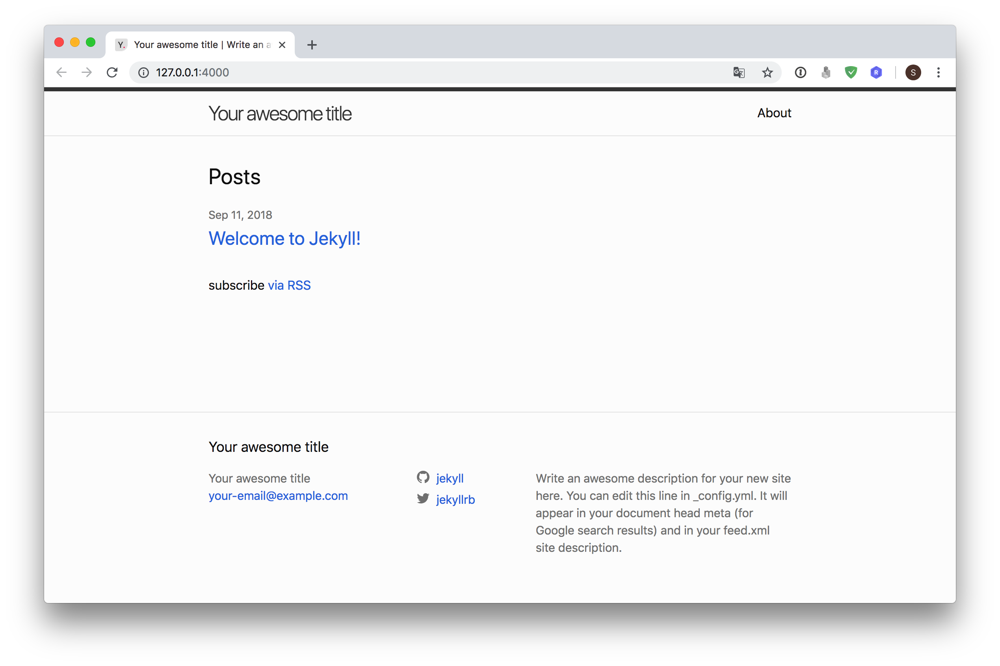
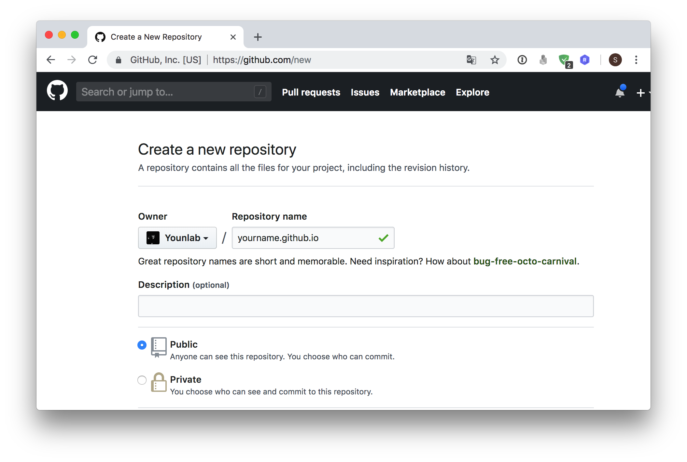

## Jekyll Blog

`Jekyll` 은 정적사이트 생성기이다. 버전관리 프로그램으로 작동하는 이 패키지는 데이터베이스를 사용하지 않고 버전관리로 포스트들을 관리하고 정적 웹사이트 라는 특징 때문에 `github` 에서 해당 서비스를 무료로 제공하고 있다.

단순한 파일 서빙으로 상당히 완성도 있는 블로그를 만들 수 있고, `github`에 포스팅하면 잔디`commit` 도 심어 나중에 개발분야 취업에 성실도를 증명할 수 있는 좋은 방법이다.

> 해당 문서는 mac 사용을 전제로 작성되었다.

## install

`jekyll` 을 `local` 에서 실행하기 위해서는 `ruby` 가 설치되어 있어야 한다. mac 에서는 시스템에 ruby 가 설치되어 있지만 그 버젼이 낮아 사용하기 어렵다. 시스템의 ruby 를 업데이트 해 주거나 `ruby` 의 버젼관리 프로그램을 사용하여 새로 설치해주자

`ruby`의 버젼관리 프로그램인 `rbenv`를 설치하기 위해서는 mac을 사용하는 개발자들은 당연히 설치되어있는 brew 로 설치한다.

```sh
brew install rbenv ruby-build
```

이미 brew 를 이용하여 `ruby` 를 설치하였다면 삭제해 주자, **충돌**의 우려가 있다.

```sh
brew uninstall ruby
```

<br>

`rbenv` 를 사용하기 위하여 shell 의 설정파일에 아래의 옵션을 추가해주자, `zsh`를 사용하는 경우 `~/.zshrc`, 기본 `bash`를 사용하는 경우 `~/.bash_profile` 에 작성한다.

```sh
# rbenv
export PATH="$HOME/.rbenv/bin:$PATH"
eval "$(rbenv init -)"
```

설정파일을 작성한 후 터미널 종료 후 재시작한다.

<br>

`rbenv`를 이용하여 `ruby`를 설치, 사용할 `ruby` 버젼을 지정한다.

```sh
rbenv install 2.5.1
rbenv global 2.5.1
rbenv versions
	system
	* 2.5.1(set by /Users/sh/.rbenv/version)
```

`*` 표가 붙은 부분이 현제 적용된 `ruby` 버젼이다.

<br>

새 `ruby`버젼이 설치 되면 `rbenv rehash` 명령어를 실행한다 해당 명령어를 사용하면 `rbenv`가 관리하는 루비 명령어들을 `~/.rbenv/shims` 디렉토리에 셸 스크립트 파일로 복사한다.

```sh
rbenv rehash
```

<br>

## ruby 패키지 관리자 RubyGems install

`RubyGems` 는 `ruby`의 패키지관리자다. 각 패키지는 `gem` 이라 불린다. 우리가 `jekyll` 블로그를 `local` 에서 실행하기 위하여 필요한 `gem`은 아래와 같다.

- jekyll
- bundler
- github-page

일반적으로 `ruby`의 패키지들은 `RubyGems`를 이용해 관리되며, 시스템 어디에서나 설치된 `gem`들을 사용할 수 있다.
<br>

하지만 프로젝트별로 필요한 각 패키지`gem`들의 버전이 다를 수 있으며, 이러한 의존성 문제를 해결하기 위해 `bundler`라는 패키지를 사용한다.
<br>

`github-page`는 `Github`에서 `jekyll`을 사용하기위해 설치하는 의존성 패키지 모음이다. `git`으로 `push`를 했을때 자동으로 나의 레포지토리에서 정적사이트를 렌더링하는데에 필요하다.

```sh
gem install jekyll bundler github-pages
```

<br>

## Local 에서 Jekyll 블로그 생성 및 실행

위의 과정을 전부 실행하고 아래의 명령어를 입력하여 블로그를 생성하자

```sh
jekyll new 블로그명
	Running bundle install in /Users/sh/Documents/posting-blog...
	  Bundler: The dependency tzinfo-data (>= 0) will be unused by any of the platforms Bundler is installing for. Bundler is installing for ruby but the dependency is only for x86-mingw32, x86-mswin32, x64-mingw32, java. To add those platforms to the bundle, run `bundle lock --add-platform x86-mingw32 x86-mswin32 x64-mingw32 java`.
	  Bundler: There was an error while trying to write to
	  Bundler: `/Users/sh/.bundle/cache/compact_index/rubygems.org.443.29b0360b937aa4d161703e6160654e47/versions`.
	  Bundler: It is likely that you need to grant write permissions for that path.


cd 블로그명
	total 48
	drwxr-xr-x   9 sh  staff   288B Sep 11 18:40 .
	drwx------+ 16 sh  staff   512B Sep 11 18:39 ..
	-rw-r--r--   1 sh  staff    35B Sep 11 18:39 .gitignore
	-rw-r--r--   1 sh  staff   398B Sep 11 18:39 404.html
	-rw-r--r--   1 sh  staff   1.0K Sep 11 18:39 Gemfile
	-rw-r--r--   1 sh  staff   1.6K Sep 11 18:39 _config.yml
	drwxr-xr-x   3 sh  staff    96B Sep 11 18:39 _posts
	-rw-r--r--   1 sh  staff   539B Sep 11 18:39 about.md
	-rw-r--r--   1 sh  staff   175B Sep 11 18:39 index.md


```

<br>

해당 디렉토리 내부로 이동하여 `Gemfile` 의 내용 일부를 수정한다. `gem "jekyll"..` 라는 부분을 주석처리하고 `gem "github-pages"...`부분을 활성화 한다.

```sh
vi Gemfile
	# Hello! This is where you manage which Jekyll version is used to run.
	# When you want to use a different version, change it below, save the
	# file and run `bundle install`. Run Jekyll with `bundle exec`, like so:
	#
	#     bundle exec jekyll serve
	#
	# This will help ensure the proper Jekyll version is running.
	# Happy Jekylling!

	# 이부분을 주석
	gem "jekyll", "~> 3.8.3"

	# This is the default theme for new Jekyll sites. You may change this to anything you like.
	gem "minima", "~> 2.0"

	# If you want to use GitHub Pages, remove the "gem "jekyll"" above and
	# uncomment the line below. To upgrade, run `bundle update github-pages`.

	# 이부분을 주석 해제
	# gem "github-pages", group: :jekyll_plugins

	# If you have any plugins, put them here!
	group :jekyll_plugins do
	  gem "jekyll-feed", "~> 0.6"
	end

```

<br>

실행전 `bundle`로 관리되는 패키지들을 update & install 시켜준다.

```sh
bundle update
bundle install
```

만일 해당 명령어가 실행되지 않고 오류(보통 관리자권한 오류)가 뜬다면 명령어 앞에 `sudo` 라고 붙여주자
<br>

로컬 서버로 실행해보자, 아래의 명령어를 입력하고 출력되는 url 에 접속해보자

```sh
bundle exec jekyll serve
	Configuration file: /Users/sh/Documents/posting-blog/_config.yml
	            Source: /Users/sh/Documents/posting-blog
	       Destination: /Users/sh/Documents/posting-blog/_site
	 Incremental build: disabled. Enable with --incremental
	      Generating...
	                    done in 0.321 seconds.
	 Auto-regeneration: enabled for '/Users/sh/Documents/posting-blog'
	    Server address: http://127.0.0.1:4000/
	  Server running... press ctrl-c to stop.
```

위에 출력된 [http://127.0.0.1:4000/](http://127.0.0.1:4000/) 로 접속해보면 아래와 같은 페이지를 확인 할 수 있다.


<br>

## Post 작성

`jekyll`의 글 작성은 기본적으로 `markdown`으로 작성한다. `jekyll` 블로그의 디렉토리 내부의 `_posts`디렉토리에 `YYYY-MM-DD-제목.md`의 형식을 가진 하나의 파일이 하나의 글이 된다.
<br>

`jekyll`을 막 생성한 경우 `_posts`디렉토리에 예제 파일이 하나 들어있으니 그것을 참고하여 글을 작성해보자 좀더 추가로 알고싶은 내용은 `jekyll`공식문서를 참고하자.
<br>

- [jekyll document(en)](https://jekyllrb.com/)
- [jekyll document(kr)](https://jekyllrb-ko.github.io/)

> 한국 공식문서는 번역기를 돌린 수준이니 많은 기대는 하지 말자

<br>

## Github에 배포

`local`에서 `bundle exec jekyll serve` 명령어를 입력하면 `jekyll` 이 자동으로 `_site` 디렉토리를 만들고 우리가 작성한 `md`file을 `html` 형식으로 자동 랜더링한다. `git`에 배포할 때는 `_site` 디렉토리를 배포하는게 아니라 소스코드를 그대로 `git`에 올리면 자동으로 랜더링해주는 서비스를 제공한다.
<br>

## Repository 생성


<br>

`Github-Page`를 이용해 `jekyll`블로그를 생성 할 때는 `자신의 github-name.github.io`라는 이름으로 저장소를 만들어야한다. 그래야 `github`에서 당신의 블로그를 감지해 랜더링한다.

## push

`.gitignore` 파일을 작성해 필요없는 내용이 `git`에 업로드 되는것을 방지하자, 내용은 아래와 같다.

```sh
vi .gitignore
	# Created by https://www.gitignore.io/api/ruby,macos,jekyll

	### Jekyll ###
	_site/
	.sass-cache/
	.jekyll-metadata

	### macOS ###
	*.DS_Store
	.AppleDouble
	.LSOverride

	# Icon must end with two \r
	Icon

	# Thumbnails
	._*

	# Files that might appear in the root of a volume
	.DocumentRevisions-V100
	.fseventsd
	.Spotlight-V100
	.TemporaryItems
	.Trashes
	.VolumeIcon.icns
	.com.apple.timemachine.donotpresent

	# Directories potentially created on remote AFP share
	.AppleDB
	.AppleDesktop
	Network Trash Folder
	Temporary Items
	.apdisk

	### Ruby ###
	*.gem
	*.rbc
	/.config
	/coverage/
	/InstalledFiles
	/pkg/
	/spec/reports/
	/spec/examples.txt
	/test/tmp/
	/test/version_tmp/
	/tmp/

	# Used by dotenv library to load environment variables.
	# .env

	## Specific to RubyMotion:
	.dat*
	.repl_history
	build/
	*.bridgesupport
	build-iPhoneOS/
	build-iPhoneSimulator/

	## Specific to RubyMotion (use of CocoaPods):
	#
	# We recommend against adding the Pods directory to your .gitignore. However
	# you should judge for yourself, the pros and cons are mentioned at:
	# https://guides.cocoapods.org/using/using-cocoapods.html#should-i-check-the-pods-directory-into-source-control
	#
	# vendor/Pods/

	## Documentation cache and generated files:
	/.yardoc/
	/_yardoc/
	/doc/
	/rdoc/

	## Environment normalization:
	/.bundle/
	/vendor/bundle
	/lib/bundler/man/

	# for a library or gem, you might want to ignore these files since the code is
	# intended to run in multiple environments; otherwise, check them in:
	# Gemfile.lock
	# .ruby-version
	# .ruby-gemset

	# unless supporting rvm < 1.11.0 or doing something fancy, ignore this:
	.rvmrc

	# End of https://www.gitignore.io/api/ruby,macos,jekyll
```

<br>

`.gitignore` 파일을 작성한 후 아래의 명령어로 `git`의 저장소에 업로드한다.

```sh
git init
git add -A
git commit -m 'First commit'
git remote add git@github.com:{yourid}/{yourid}.github.io.git
git push origin master
```

<br>

5 ~ 10분정도 기다리다 해당하는 주소 `yourid.github.io` 로 접속하면 우리의 블로그가 랜더링되어 게시되어 있다.
<br>

> 본 문서는 [lhy.kr](https://lhy.kr) 의 이한영 강사님의 글을 업데이트 하여 작성되었습니다.
