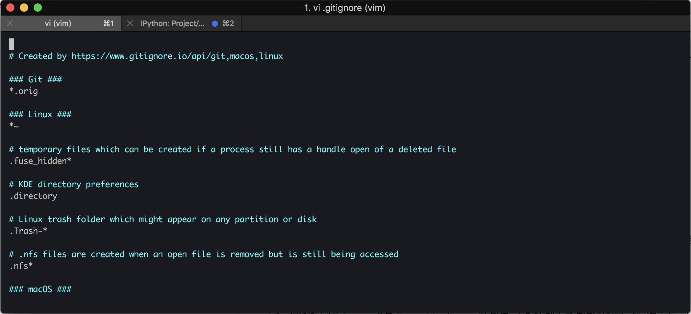

## Index

- 기본 개발환경

      	- Homebrew
      	- git
      	- bash, oh-my-bash
      	- iterm2
      	- vim
      	- vim Highlight
      	- tree
      	- Atom Editer

- python, Django 개발환경

      	- python3
      	- pyenv
      	- pipenv
      	- pycharm

## Homebrew


Homebrew는 패키지 관리자다. 개발하는 Mac 유저는 brew 를 무조건 깔고 시작한다. 자세한 설명은 Homebrew 홈페이지에서 긁어왔다.

### summary

홈브류는 오픈 소스 소프트웨어 패키지 관리 시스템의 하나로서 애플의 macOS 운영 체제의 소프트웨어 설치를 단순하게 만들어 줍니다. 원래 맥스 호웰이 개발한 이 패키지 관리자는 루비 온 웨일즈 공동체에서 인기를 얻었으며 확장성으로 호평을 받았다.

홈브루는 쉬운 사용성, 명령 줄로의 통합이 가능하므로 이용이 권장된다. 홈브루는 깃허브를 활용하여 사용자 기여를 통한 여러 패키지들의 지원을 확장한다.

### install

```bash
xcode-select --install
```

설치 전 Xcode 개발자 도구가 설치되어 있어야한다.

```bash
/usr/bin/ruby -e "$(curl -fsSL https://raw.githubusercontent.com/Homebrew/install/master/install)"
```

터미널에 복사/붙여넣기 후 엔터를 입력하면 설치가 시작된다.

```bash
brew install nodejs
```

전부 설치후 필요한 패키지를 `brew install {패키지 이름}` 으로 설치한다.

## git


대표적인 버전관리 툴인 `git` 이다. 앞의 `oh-my-bash` 의 Plugin 을 설치하기 위해서는 선행 설치 되어있어야한다. `git` 에 대해서는 따로 페이지를 할당하여 자세히 설명한다.

### install

```bash
brew install git git-lfs
```

마찬가지로 `homebrew` 로 설치한다.

### Setting

```bash
git config --global user.name "Your Name"
git config --global user.email "you@your-domain.com"
git config --global core.precomposeunicode true
git config --global core.quotepath false
```

설치가 완료되면 나의 git에 대한 Userinfo 설정을 해준다.

## iterm2


iterm2 는 기본 터미널에 없는 특수하고 강력한 기능이 있다. 바로 테마 기능이다. 개발자라면 자신만의 스타일의 터미널 하나쯤 있는것도 좋지 않을까?

### install

```bash
brew cask install iterm2
```

### Setting

자세한 테마 세팅은 너무 잘 설명한 블로그가 있기 때문에 한번 둘러보고 오자

[본격 macOS에 개발 환경 구축하기](https://subicura.com/2017/11/22/mac-os-development-environment-setup.html)

## bash

- 현재 바라보고 있는 패스 안내 (CWD)
- python user를 위한 virtualenv 안내
- ruby user를 위한 RVM 안내
- node.js user를 위한 NVM 안내
- git 사용자를 위한 현 브랜치 상태 및 스테이징 커밋 여부 안내

기본적으로 제공되는 UI가 기본 Shell 인 bash 보다 좀더 편리하기 때문에 대부분의 개발자는 컴퓨터를 세팅할 때 기본적으로 설치하는 기능이다.

### install

```bash
brew install bash bash-completions
```

### install oh-my-bash

```bash
sh -c "$(curl -fsSL https://raw.githubusercontent.com/robbyrussell/oh-my-bash/master/tools/install.sh)"
```

위에서부터 순번으로 설치해 주면 자동으로 기본 Shell 이 bash 에서 bash 로 변경된다.

### install Plugin

oh-my-bash 를 설치하면 강력한 플러그인을 사용할 수 있다. 기본적으로 설치되어 있는 Plugin 외에 명령어 하이라이팅(해당하는 코드 별 색상으로 구분해주는 기능) `bash-syntax-highlighting` 과 이미 한번 입력해 본적이 있는 명령어를 기억하고 해당 키워드를 타이핑 했을 때에 자동으로 팝업 해주는 자동완성 플러그인 `bash-autosuggestions` 을 설치하자.

해당 install 명령어는 `git`이 먼저 설치되어 있는것을 가정한다.

```bash
# bash-syntax-highlighting
git clone https://github.com/bash-users/bash-syntax-highlighting.git ${bash_CUSTOM:-~/.oh-my-bash/custom}/plugins/bash-syntax-highlighting

# bash-autosuggestions
git clone git://github.com/bash-users/bash-autosuggestions $bash_CUSTOM/plugins/bash-autosuggestions
```

플러그인을 설치하면 반드시 `~/.bashrc` 파일에 설정을 기입하여야 한다. 해당 파일을 열고 `plugins` 항목에 아래의 옵션을 추가하자.

```bash
plugins=(
  git
  bash-syntax-highlighting
  bash-autosuggestions
)
```

옵션을 추가하고 `source ~/.bashrc` 명령어를 입력해 bash를 재실행 시켜주면 해당 플러그인이 적용된다. `source ~/.bashrc` 명령어를 입력하지 않으면 터미널을 재시작 하기 전까지는 적용되지 않는다.

## vim

vim은 터미널 내부에서 간단하게 code 를 편집할때 자주 사용하는 기능이다. mac 에는 기본적으로 `vi` 라는 비슷한 패키지가 이미 설치되어 있는데 vim 을 설치해주면 좀더 편리하게 사용할 수 있다. 자세한 설명은 위키에서 긁어왔다.

### summary

Vim(빔[1], Vi IMproved)은 Bram Moolenaar가 만든 vi 호환 텍스트 편집기이다. CUI용 Vim과 GUI용 gVim이 있다. 본래 아미가 컴퓨터 용 프로그램이었으나 현재는 마이크로소프트 윈도, 리눅스, 맥 오에스 텐을 비롯한 여러 환경을 지원한다.

Vim은 vi와 호환되면서도 독자적으로 다양한 기능을 추가하여 사용자의 편의를 돕고 있다. 특히 Vim 스크립트 등을 사용해서 자유롭게 편집 환경을 변경하거나, 확장된 정규 표현식 문법, 강력한 문법 강조 기능, 다중 되돌리기, 유니코드를 비롯한 다국어 지원, 문법 검사 등을 쓸 수 있다는 점이 강점으로 꼽힌다. 한편으로는 vi와 마찬가지로 처음에 배우기 어렵다는 점이 단점으로 지적되는데, 이를 극복하기 위해 쉬운 Vim 모드를 지원한다.

### install

```bash
brew install vim
```

brew 로 설치한다.

## vim Highlight Setting


vim 을 그냥 쓰기에는 너무 밑밑하다. 해당하는 code 의 형식에 맞게 색깔별로 higlight 를 넣어주는 기능을 활성화 하자.
